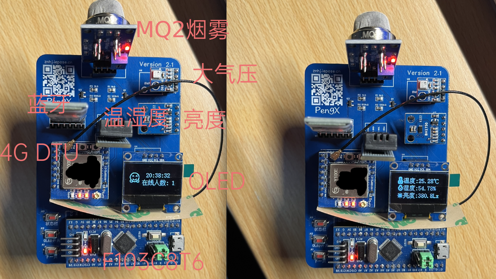

<p align="center">
  
</p>


<p align="center">
  <a href="https://www.gnu.org/licenses/gpl-3.0">
    
  </a>
</p>
# STM32 智能环境监测系统  Version 1.0.5（正式版）

本仓库为「电子信息工程专业」毕业设计《基于 STM32 和物联网的智能环境监测系统》的工程代码，面向实验室、机房、宿舍等小场景的 **多设备多传感器环境监测云平台**。  

系统采用“STM32 端采集 + 4G/蓝牙上行 + FastAPI 云端服务 + Web 可视化 + AI 分析”的技术路线，由两大部分组成：

- `oled/`：基于 **STM32F103C8T6** 的多传感器采集与异常检测固件（AHT20、BH1750、BMP180、MQ2 等），通过 OLED 显示本地状态并通过串口/4G 模块/蓝牙上报数据。
- `PythonProject/`：基于 **FastAPI + WebSocket + MQTT + MySQL** 的后端与 Web 前端，提供实时仪表盘、历史分析、异常告警闭环、AI 助手等功能，正式版 1.0 起支持多设备汇聚、总览与独立省电控制。

**正式版 1.0 更新内容速看：**

- **关键词：** 支持**多设备**，支持自由切断**多传感器**，支持真正的STM32<=>云端双向通信。

- 新增多设备云平台与设备总览主页，统一查看在线状态与温湿度等核心数据。
- 后端 API、数据库与提示词全面重写，支持多达 5 台设备的省电控制列表与独立传感器开关。
- STM32 端新增状态栏与更安全的 OLED 关闭流程，搭配 PCB 2.1+ 支持硬件级传感器断电。
- **端云双向通信亮点：** 单片机不仅会通过 BLE / 4G 持续向服务器上报传感器数据和异常状态，还会定期从服务器实时获取“当前时间 + 在线人数”等云端状态，在 OLED 状态栏上滚动展示，实现真正意义上的 MCU ↔ 服务器双向互动。
  
  - 端云交互示意：
  
    ```text
    ┌────────── OLED 状态栏 ──────────┐        ┌───────────── 服务器 ─────────────┐
    │  12:34:56         			 │◀──────▶│  统计在线人数 + 计算当前时间      │
    │  在线人数: 3 人      		   │   MQTT  │  将状态帧通过 MQTT/BLE 实时下发  │
    └───────────────────────────────┘        └──────────────────────────────────┘
    ```

**之前迭代了那么多 Beta 版本？为什么现在推出正式版？**

- 功能上，从最初的单设备 Demo 演进到支持多设备、多传感器、多链路（BLE/MQTT）的完整云平台，已经覆盖初版中规划的全部核心能力，不再只是“验证想法”的原型。
- 稳定性上，多个 Beta 版本反复打磨了阈值配置、滤波算法、链路切换与异常自愈逻辑，端到端在真实环境中长时间运行稳定，可以作为可靠的基线版本。
- 工程上，软硬件形态已经基本定型：PCB Version 2.1、端云协议、数据库结构和主要 API 都趋于稳定，因此用 v1.0.0 作为清晰里程碑，方便后续以 1.1 / 1.2 等版本做增量优化。


> 在线体验地址：https://znhj.iepose.cn  

<span>


</span>
<span>


</span>

硬件展示：



---

## 1. 项目背景与总体架构

### 1.1 背景与设计目标

- 本设计目标是实现一个 **端云一体** 的环境监测系统，完整覆盖：
  - 传感器选型与硬件电路设计；
  - STM32 嵌入式固件编写与通信协议设计；
  - 4G/蓝牙到云端的数据链路与异常告警机制；
  - 基于 FastAPI 的后端服务与 Web 实时可视化；
  - 接入 AI 模型的异常分析与人机交互辅助。
- 正式版 1.0 进一步面向 **多实验室/多房间的多设备部署**，希望一套平台即可汇聚多块 STM32 设备的数据，集中做监测、分析与节能调度。
- 相比传统“只做一端”的课题，本项目强调 **从底层硬件到上层应用的全链路打通**。

### 1.2 总体架构

从硬件到云端的整体数据流如下：

```text
┌────────────────────────┐
│  传感器硬件层          │
│  AHT20 / BH1750 /      │
│  BMP180 / MQ2 / ...    │
└─────────────┬──────────┘
              │ I²C / ADC / GPIO
              ▼
   ┌────────────────────┐
   │ STM32F103C8T6 固件 │ (oled/) ──┐
   │ - 多传感器采集     │            │  串口帧 "T=...H=...L=...R=...Y=...W=...P=..."
   │ - 多级滤波与异常检测│           │
   │ - OLED 多页面 UI   │            │
   │ - 串口/4G/蓝牙上传 │            │
   └─────────┬──────────┘            │
             │                       │
             │            ┌────────────────────┐
             │            │ STM32F103C8T6 固件 │ (多设备示例)
             │            │ - 同款固件/传感器  │
             │            │ - 串口/4G/蓝牙上传 │
             │            └─────────┬──────────┘
             │                       │
             ▼                       ▼
      ┌───────────────┐      ┌───────────────┐
      │ 边缘/网关设备 │      │ 边缘/网关设备 │   BLE / MQTT
      └───────────────┘      └───────────────┘
             │                       │
             └────────────┬──────────┘
                          ▼
                ┌──────────────────────┐
                │ Python 后端服务      │ (PythonProject/)
                │ - FastAPI REST API  │
                │ - WebSocket 推送    │
                │ - MQTT 消费 & 命令  │
                │ - MySQL 持久化      │
                │ - AI 助手（DeepSeek）│
                └─────────┬────────────┘
                          │
             ┌────────────┴────────────┐
             │                         │
     ┌───────────────┐         ┌───────────────┐
     │ MySQL 数据库  │         │ Web 前端 (PWA)│
     │ 历史记录/告警 │◀─Axios──▶ index / analysis 等
     └───────────────┘         └───────────────┘
```

**多设备协同（v1.0）**：

- 云端以设备 ID 为主键汇聚多块 STM32 设备的数据，统一落库、统一告警，同时保留单设备独立的异常闭环。
- Web 端新增“设备总览”作为首页，集中展示每台设备的在线状态、连接类型（BLE/MQTT）、关键传感器读数与告警提醒。
- 多设备省电控制列表支持针对单台设备切换模式、关闭指定传感器或整机节能，前端控制项和后端命令均按设备隔离。
- AI 数据分析助手与历史分析页面均可按设备过滤/比对，实现跨设备的对比分析。

**端云双向通信（MCU ↔ Server）**：

- 上行链路：单片机通过 BLE / 4G 周期性发送传感器数据与告警状态到服务器，用于实时看板、历史存储与 AI 分析。
- 下行链路：服务器根据当前在线人数、系统时间和控制策略，将“当前时间 + 在线人数”等状态信息与控制指令下发到单片机，驱动 OLED 状态栏与省电控制实时更新。

---

## 2. 仓库目录结构

```text
.
├── PythonProject/          # 后端 + Web 前端 + 演示示例
│   ├── server.py           # FastAPI 入口 + MQTT/BLE/WS/REST/AI 逻辑
│   ├── db_manager.py       # MySQL 连接池、表结构管理与数据访问
│   ├── secrets_manager.py  # 读取 secrets.txt，统一管理密钥与配置
│   ├── web/                # Web 前端（PWA 仪表盘、历史分析页面等）
│   ├── scripts/            # 工具脚本（含 README 更新日志同步工具）
│   └── requirements.txt    # Python 依赖列表
│
├── oled/                   # STM32F103C8T6 固件工程
│   ├── Core/               # CubeMX 生成的源代码（main.c 等）
│   ├── cmake/              # 工具链与 CMake 配置
│   ├── CMakeLists.txt      # 顶层 CMake 配置
│   ├── CMakePresets.json   # 常用构建预设（Debug/Release）
│   ├── STM32F103XX_FLASH.ld# 链接脚本
│   ├── oled.ioc            # STM32CubeMX 工程文件
│   └── ...                 # 构建输出与 HAL 驱动等（例如 build/、Drivers/，通常由工具自动生成并被忽略）
│
└── README.md               # （你正在看的）项目总览与汇总文档
```

---

## 3. 功能总览

### 3.1 硬件端（oled/）

- **多传感器融合**：AHT20 温湿度、BH1750 亮度、BMP180 气压/温度/海拔、MQ2 烟雾/可燃气体。
- **多级滤波与异常检测**：范围限幅、变化率限制、中值滤波、趋势检测等（见下文“单片机端滤波方案概述”）。
- **OLED 多页面 UI**：单键切换温湿度/亮度、气压/高度、MQ2 Rs/Ro 与 PPM 等多页面。
- **双串口上报**：支持 Air780e（4G 模块）与蓝牙串口（BT27），依据 BLE 状态自动选择输出通道。
- **多路 MOSFET 供电控制**：`BH1750_POWER`（PA5）、`BPM180_POWER`（PA6）、`BLE_POWER`（PA7）、`OLED_POWER`（PB0）、`MQ2_POWER`（PB1）五路输出驱动 PCB 2.1+ 上的 MOSFET，实现 BH1750、BMP180、BLE、OLED、MQ2 的硬件级断电/上电。
- **远程控制（多模块）**：通过文本指令（如 `ONMQ2` / `OFFMQ2`、`ONBLE` / `OFFBLE`、`ONBH1750` / `OFFBH1750`、`ONBPM180` / `OFFBPM180`、`ONOLED` / `OFFOLED`）以及来自服务器的控制命令，实现多模块的省电调度与安全关断。
- **多按键交互**：`SWITCH_KEY`（PB12）用于浏览监测页，新增 `STATE_KEY`（PB14）一键切换状态栏页面，`OLED_KEY`（PB13）可本地安全断电/重启 OLED，配合 `BLE_STATE`（PA8）输入增强端侧交互体验。
- **阈值告警**：温湿度、亮度、气压、PPM 超过设定阈值并持续一定时间后，自动上报告警消息。
- **现代构建链路**：CMakePresets + Ninja + GCC ARM 工具链，支持 VS Code / CLion / 命令行统一构建。
- **多设备部署友好**：每块板载固件保持一致，云端通过设备标识区分数据；多台设备可同时在线上报，不会互相干扰。
- **状态栏双向通信**：MCU 端定期向服务器发起状态请求，实时接收“当前时间 + 在线人数”等信息并在 OLED 顶部状态栏滚动展示，让端侧一眼看到云端整体在线情况。

**硬件组成（模块级）：**

| 模块 | 接口/资源 | 说明 |
| --- | --- | --- |
| STM32F103C8T6 | Cortex-M3 @ 72 MHz，64 KB Flash | 主控，使用 STM32Cube HAL |
| OLED 128×64 | I²C（`hi2c1`） | 多页面数据显示 |
| DHT20 | I²C | 温湿度采集 |
| BH1750 | I²C | 亮度（Lux）测量，单次高分辨率模式 |
| BMP180 | I²C | 气压、温度、海拔（OSS_3） |
| MQ2 | ADC1 通道 + GPIO 控电 | 烟雾/可燃气体，支持快速校准与远程断电 |
| Air780e | USART2 + DMA | 蜂窝物联网模组，上报数据到云端 |
| BT27 | USART3 + DMA | 本地 BLE/串口透传 |
| SWITCH_KEY | PB12 输入 | OLED 页面切换按键 |
| OLED_KEY | PB13 输入 | 单次按压即可在 MCU 端实现 OLED 供电的安全断电/上电 |
| STATE_KEY | PB14 输入 | 快速在监测页与状态栏之间切换 |
| BLE_STATE | PA8 输入 | 蓝牙连接状态输入，引导串口路由 |

**接线图与引脚对应：**

> 所有 I²C 设备（OLED、AHT20、BH1750、BMP180）共用 `3.3 V` 与 `GND`，并并联在 `PB6/PB7` 上；MQ2 传感器使用 `5 V` 供电且模拟输出接入 `PA0`。

**I²C 总线（`hi2c1`，400 kHz）：**

| 设备 | VCC | GND | SCL | SDA | 备注 |
| --- | --- | --- | --- | --- | --- |
| OLED 128×64 | 3.3 V | GND | PB6 | PB7 | 地址 `0x3C`，I²C OLED |
| AHT20 | 3.3 V | GND | PB6 | PB7 | 地址 `0x38` |
| BH1750 | 3.3 V | GND | PB6 | PB7 | `ADDR` 接 VCC → 地址 `0x5C` |
| BMP180 | 3.3 V | GND | PB6 | PB7 | OSS_3，高精度模式 |

**简化拓扑（俯视）：**

```text
PB6 ──────────┬─ OLED SCL
              ├─ AHT20 SCL
              ├─ BH1750 SCL
              └─ BMP180 SCL

PB7 ──────────┬─ OLED SDA
              ├─ AHT20 SDA
              ├─ BH1750 SDA
              └─ BMP180 SDA
```

**模拟/控制接口：**

| 设备 | 引脚 | STM32F103 引脚 | 说明 |
| --- | --- | --- | --- |
| MQ2 模拟输出 | AOUT | `PA0` (`ADC1_IN0`) | 周期采样 + 多级滤波 |
| MQ2 供电 | VCC | 5 V | 建议同电源旁加 0.1 µF + 10 µF 退耦 |
| MQ2 地 | GND | GND | 与 MCU 共地 |
| MQ2 电源控制 | EN/VCC_SW | `PB1` (`MQ2_POWER`) | 文本指令 `ONMQ2` / `OFFMQ2` 远程开关 |
| OLED 电源控制 | EN/VCC_SW | `PB0` (`OLED_POWER`) | 手动按键或 `ONOLED` / `OFFOLED` 指令触发安全断电流程 |
| BH1750 供电控制 | EN/VCC_SW | `PA5` (`BH1750_POWER`) | 通过 MOSFET 控制亮度传感器供电，搭配 `ONBH1750` / `OFFBH1750` 指令 |
| BMP180 供电控制 | EN/VCC_SW | `PA6` (`BPM180_POWER`) | 控制 BMP180 供电，避免闲时功耗 |
| BLE 模块供电 | EN/VCC_SW | `PA7` (`BLE_POWER`) | 通过 `ONBLE` / `OFFBLE` 指令或服务器策略硬件断电 |
| SWITCH_KEY | 一端 | `PB12` | 上拉输入 |
| SWITCH_KEY | 另一端 | GND | 按下接地实现页面切换 |
| OLED_KEY | 一端 | `PB13` | 非自锁按键，短按切换 OLED 供电 |
| OLED_KEY | 另一端 | GND | 按下接地触发 |
| STATE_KEY | 一端 | `PB14` | 控制监测页/状态栏切换 |
| STATE_KEY | 另一端 | GND | 按下接地触发 |
| BLE_STATE 输入 | 模块状态脚 | `PA8` | 高电平表示蓝牙连接，控制串口路由 |

**串口与无线模组：**

| 通讯对象 | STM32 引脚 | 外设引脚 | 说明 |
| --- | --- | --- | --- |
| Air780e（蜂窝） | `PA2` (`USART2_TX`) → 模块 RX | `PA3` (`USART2_RX`) ← 模块 TX | 115200 bps，上报环境帧 |
| BT27（蓝牙） | `PB10` (`USART3_TX`) → 模块 RX | `PB11` (`USART3_RX`) ← 模块 TX | 9600 bps + DMA，`BLE_STATE` 决定是否发射 |

**串口数据协议（示例）：**

```text
T=25.31H=42.88L=123.4R=1.27Y=35.6W=24.5P=1012.8
```

| 字段 | 含义                         |
| ---- | ---------------------------- |
| T    | AHT20 温度（℃）             |
| H    | AHT20 相对湿度（%）         |
| L    | BH1750 亮度（Lux）          |
| R    | MQ2 Rs/Ro 比值              |
| Y    | MQ2 估算 PPM（气体浓度）    |
| W    | BMP180 温度（℃）            |
| P    | BMP180 气压（hPa）          |

数据会周期性输出到可用串口（优先蓝牙，退回 4G 模块），后端解析后写入数据库并推送到 Web 前端。

#### 单片机端滤波方案概述

针对 AHT20 温湿度、MQ2 烟雾等通道，在 STM32 端实现了多层次的传感器数据滤波与异常判定逻辑，核心围绕以下几部分展开。

1. **范围限幅滤波（Range Limit）**  
   为每个物理量设置合理的上下限（如温度、湿度、PPM 等），超出物理范围的值直接被视为无效，使用上一次的有效值替代，用于快速滤除明显错误数据。

2. **非对称变化率限制滤波（Asymmetric Rate-of-Change）**  
   对上升和下降采用不同的变化率阈值。例如：
   - 对温度，上升方向使用较小阈值（如 5 ℃/采样），严格限制异常飙升；下降方向使用较大阈值（如 15 ℃/采样），允许快速冷却；
   - 对 MQ2 的 Rs/Ro 与 PPM，则反过来：上升方向较宽松以快速响应火情或浓度上升，下降方向较严格以避免噪声导致的虚假“恢复”。  
   通过这种非对称设计，在安全性与稳定性之间取得折中。

3. **连续上升趋势检测（Consecutive Rise Trend）**  
   仅依靠单次变化率阈值难以区分真实火情与单次脉冲干扰。为此滤波器为每个通道维护“连续上升次数”和“趋势起始值”：
   - 当温度等量连续多次上升（如连续 3 次）时，进入“紧急模式”，允许更大的瞬时变化，但同时检查累计上升是否在合理范围内，以确认是真实趋势而非单次异常；
   - 正常模式下使用更严格的单次变化率限制。  
   该机制使系统对持续变化更敏感，对孤立异常更鲁棒。

4. **中值滤波 + 快速模式（Median Filter with Fast Mode）**  
   每个通道维护一个中值滤波缓冲区（典型窗口大小为 5）：
   - 缓冲区未填满时启用“快速模式”，直接输出当前值，以保证上电后尽快有可用显示；
   - 缓冲区填满后对窗口内数据排序取中值输出，增强对脉冲干扰的抑制能力。  
   通过这种方式在启动阶段保证实时性，在稳定阶段保证平滑性。

5. **超时重置机制（Timeout Reset）**  
   若某通道在一定时间内（如 5 s）未接受新数据，则认为当前滤波状态可能已失真，强制清空缓冲区并接受新值，解决“变化率过严导致长时间卡在旧值”的问题。

6. **统一阈值与告警联动**  
   滤波后的结果会与统一配置的阈值结构体（温度、湿度、亮度、PPM、气压等）进行比较；当某物理量连续超阈值并持续超过设定时长（例如 3 s）时，触发告警模块生成告警消息并通过串口输出，与后端 `warning_data` 告警闭环逻辑相对应。

在代码层面，以中值滤波结构体为核心，将范围检查、变化率限制和趋势检测统一组织起来（节选自 `oled/Core/Src/main.c` 与滤波方案文档）：

```c
typedef struct {
    float   buffer[MEDIAN_FILTER_SIZE]; // 滑动窗口
    uint8_t index;                      // 循环写入索引
    uint8_t count;                      // 当前有效样本数
    float   lastValue;                  // 上次输出值
    uint32_t lastUpdateTime;            // 上次更新时间
    uint8_t consecutiveRiseCount;       // 连续上升次数
    float   trendStartValue;            // 趋势起点值
} MedianFilter_t;
```

每次采样时，典型流程为：

```c
// 1. 范围检查（超范围直接丢弃，回退到 lastValue）
if (rawTemp < TEMP_MIN || rawTemp > TEMP_MAX) {
    return tempFilter->lastValue;
}

// 2. 超时重置（长时间未更新则清空缓冲区）
if (currentTime - tempFilter->lastUpdateTime > TIMEOUT_MS) {
    tempFilter->count = 0;
}

// 3. 非对称变化率 + 连续上升趋势判断
float delta = rawTemp - tempFilter->lastValue;
// ……根据符号和大小更新 consecutiveRiseCount，并区分正常模式 / 紧急模式 ……

// 4. 中值滤波（缓冲区未满时可启用快速模式，直接返回 rawTemp）
float filtered = MedianFilter_Process(tempFilter, rawTemp, /*fastMode=*/1, currentTime);
```

通过这种“先做逻辑判定，再做中值滤波”的处理顺序，既可以明确哪些数据被认为是异常（并记录趋势信息），又能在最终输出阶段保持曲线的平滑与可读性。新增传感器时，只需为对应通道配置合理的范围、变化率和超时参数，即可复用同一套滤波框架。

### 3.2 后端服务与 AI 助手（PythonProject/server.py）

- **FastAPI REST API**：对外提供传感器数据查询、设备控制、位置查询（AMap）、AI 交互等接口。
- **WebSocket 实时推送**：将最新传感器状态、告警消息等以 WebSocket 流式推送至前端。
- **MQTT 与 BLE 双通道**：优先使用蓝牙直连，自动回落到 MQTT（EMQX）云端数据，保障链路连续性。
- **MySQL 持久化**：`sensor_readings`、`warning_data`、`sensor_states` 等表记录历史数据与设备状态。
- **告警闭环**：自动检测异常、写入告警表、在链路恢复时自动标记恢复状态，并在前端展示时间线。
- **AI 助手集成**：集成 DeepSeek 在线模型，同时预留离线模型接口，支持多轮对话与健康检查端点。
- **多设备汇聚与隔离**：所有链路都带有设备 ID，WebSocket 订阅、REST 查询与控制命令按设备路由；多设备同时在线不会互相抢占链路。
- **面向 MCU 的下行通道**：后端会根据设备状态与在线用户数，构造轻量的状态帧（如当前时间、在线人数、省电模式等），通过 BLE/MQTT 回传给对应单片机，实现状态栏展示与远程控制。

### 3.3 Web 前端（PythonProject/web/）

- **设备总览主页（v1.0）**：新的默认首页展示所有设备在线状态、连接方式（BLE/MQTT）、关键传感器读数与异常提醒，可快速跳转到单设备详情或控制。
- **实时仪表盘**：`index.html` 展示温度、湿度、亮度、烟雾等多指标卡片，适配深浅色与移动端。
- **历史分析页面**：`analysis.html` 通过 Chart.js 等组件，实现时间区间筛选、曲线分析与对比。
- **消息中心与地图定位**：基于 `warning_data` 的告警列表，以及高德地图定位与展示。
- **PWA 支持**：通过 manifest 与 Service Worker（可选），在移动端表现为类 App 的体验。
- **统一样式与组件**：`common.js`、`common-styles.css` 提供主题切换（深色模式等）、时间轴与图表封装。

**核心页面说明：**

- `web/index.html`：主页仪表盘
  - 顶部显示连接状态（BLE/MQTT/数据库/AI 等健康状态）；
  - 居中区域以卡片形式展示温度、湿度、亮度、烟雾浓度等实时指标；
  - 支持 MQ2 模式展示与切换入口（省电/平衡/安全/一直开启/开发者模式）；
  - 集成地图定位与“关于项目/使用帮助”入口；
  - 内嵌 AI 助手面板，支持流式对话与对话终止。
- `web/analysis.html`：历史分析
  - 提供时间区间选择器，可按自定义时间范围加载数据；
  - 支持多条数据曲线叠加（例如温度/湿度/亮度/气压/PPM 等）；
  - 内置统计信息与异常标记，帮助分析某段时间的环境波动；
  - 针对大数据量做了加载优化，根据数据量动态调整加载节奏。
- `web/easter.html`：彩蛋页面，用于展示项目题目。

**前端交互与状态管理：**

- 使用 `web/common.js` 抽象出：
  - WebSocket 连接与重连策略；
  - 主题切换（深色/浅色）与本地持久化；
  - 图表封装（基于 Chart.js 或自研工具），统一图例、颜色与时间轴格式；
  - 时间轴/消息中心组件，含日期筛选、自动滚动等逻辑。
- `web/changelog-data.js` 维护更新日志数据，供前端“关于项目”页与本 README 共享。
- 整体前端以原生 HTML/CSS/JS 为主，避免引入过重框架，方便学习与二次开发。

---

## 4. 环境与快速开始

下面给出系统运行环境与整体启动步骤。

### 4.1 运行环境

软件与服务端环境：

- Python 3.8 及以上版本，建议使用虚拟环境管理依赖；
- MySQL 8.0（或兼容版本），用于存储传感器数据与告警记录；
- MQTT Broker（默认使用 EMQX，启用 TLS/SSL，端口 8883，对应 CA 证书存放于 `PythonProject/cafile/`）；
- 操作系统需支持 BLE（如需启用蓝牙链路），Windows 下需设置合适的 asyncio 事件循环策略；
- DeepSeek API Key（可选，用于启用在线 AI 模型）。

嵌入式与编译环境（如需自行编译固件）：

- CMake ≥ 3.22 与 Ninja ≥ 1.10；
- `arm-none-eabi-gcc` 工具链（推荐 10.x 及以上）；
- STM32CubeMX（用于查看与调整 `oled/oled.ioc` 中的外设与引脚配置）；
- ST-LINK CLI、STM32CubeProgrammer 或 `st-flash` 等任一烧录工具。

在仅复用已编译固件、专注后端与前端调试时，可以只准备软件与服务端环境。

### 4.2 克隆仓库

```bash
git clone <repo-url>
cd bishe_proj   # 本仓库根目录
```

### 4.3 启动 Python 后端与 Web

进入 Python 项目目录：

```bash
cd PythonProject
python -m venv .venv
source .venv/bin/activate  # Windows: .venv\Scripts\activate
pip install -r requirements.txt
```

在 `PythonProject/` 目录下创建 `secrets.txt`，根据下面的模板填入配置：

```text
# MQTT 账号配置
MQTT_USERNAME=
MQTT_PASSWORD=

# DeepSeek API Key
DEEPSEEK_API_KEY=

# 数据库 （根据你的系统填写）
DB_ADDR_MAC=
DB_PASSWORD_MAC=
DB_ADDR_WIN=
DB_PASSWORD_WIN=
DB_ADDR_LINUX=
DB_PASSWORD_LINUX=

# 高德地图 Web JS API Key
AMAP_WEB_KEY=
```

字段说明（简要）：

- `MQTT_USERNAME` / `MQTT_PASSWORD`：连接 MQTT Broker（默认 EMQX）的账号密码；
- `DEEPSEEK_API_KEY`：调用 DeepSeek 在线模型的 API 密钥，留空则仅使用本地/兼容模式；
- `DB_ADDR_*` / `DB_PASSWORD_*`：不同系统下 MySQL 实例的地址与密码，后端会根据当前操作系统自动选择；
- `AMAP_WEB_KEY`：高德地图 Web JS API 的密钥，用于前端地图定位与展示。

关键配置项（后端与前端）：

| 文件 | 位置 | 说明 |
| --- | --- | --- |
| `PythonProject/server.py` | `MQTT_*` 常量 | MQTT Broker 地址、端口、主题、证书路径与鉴权方式 |
| `PythonProject/server.py` | `BLE_DEVICES` | 蓝牙传感器别名与 MAC 地址映射 |
| `PythonProject/server.py` | `DEEPSEEK_API_KEY` / `DEEPSEEK_ONLINE_MODELS` | AI 助手模型与访问配置 |
| `PythonProject/db_manager.py` | `database_info` | MySQL 连接配置，结合 `secrets.txt` 使用 |
| `PythonProject/web/index.html` | 高德地图脚本引入处 | 绑定高德地图 Web JS API Key |
| `PythonProject/resource/manifest.json` | `short_name` / `start_url` 等 | 调整 PWA 名称、启动页面与图标等属性 |

准备好 MySQL 与 MQTT Broker（如 EMQX），并确保 `db_manager.py` 中的连接配置与 `secrets.txt` 一致，完成建表后运行：

```bash
python server.py
```

成功后即可通过浏览器访问：

- `http://<服务器地址>:<端口>/`：实时仪表盘（默认主页）
- `http://<服务器地址>:<端口>/analysis.html`：历史分析

> 如需自定义部署（例如 Docker/云服务器）、调整数据库结构或增加新接口，可直接查看 `PythonProject/server.py` 与 `PythonProject/db_manager.py` 中的实现。

### 4.4 编译并烧录 STM32 固件（可选但推荐）

硬件开发相关内容集中在 `oled/` 目录。你可以选择以下任一方式：

1. **使用 STM32CubeIDE / Keil 等传统 IDE**
   - 打开 `oled/oled.ioc`，由 CubeMX 重新生成工程，再导入到 IDE。
   - 将 `Core/` 与 `Drivers/` 目录配置为工程源代码与头文件路径。
2. **使用 CMake + arm-none-eabi-gcc（推荐，因为本项目使用的就是Clion+Cmake）**

在具备 ARM 工具链的环境中：

```bash
cd oled
cmake --preset Debug
cmake --build --preset Debug
```

构建成功后，在 `build/Debug/` 目录下会生成 `oled.elf` / `oled.bin` 等文件，可通过 ST-LINK、CubeProgrammer 或 `st-flash` 烧录：

```bash
st-flash write build/Debug/oled.bin 0x08000000
```

开发 STM32 部分时，通常需要：

- 安装 `arm-none-eabi-gcc` 工具链（推荐 10.x 及以上）与 `CMake`、`Ninja`；
- 使用 STM32CubeMX 打开 `oled/oled.ioc` 检查/调整外设配置（尤其是 I²C/ADC/USART 与引脚）；
- 使用任意烧录工具（如 ST-LINK CLI、STM32CubeProgrammer 或 `st-flash`）将生成的固件写入目标板；
- 通过串口调试助手或蓝牙串口工具观测输出帧是否符合前文的数据协议示例。

---

## 5. 数据表与告警闭环概览（后端）

后端主要围绕以下几张表展开（以 `PythonProject` 中的实现为准），所有记录都带有设备标识，方便多设备并行管理：

- `sensor_readings`：保存温度、湿度、亮度、MQ2 PPM、Rs/Ro、辅助温度、气压等传感器原始/处理数据。
- `warning_data`：记录异常类型、触发时间、恢复时间、异常值与备注等，用于前端消息中心展示。
- `sensor_states`：记录 MQ2 等设备的工作模式（例如省电/平衡/安全/一直开启/开发者模式）、供电周期和运行状态。
- （设备元数据）用于标记设备在线状态、连接通道与 PCB/固件版本，供设备总览与控制面板使用。

告警闭环的典型流程：

1. STM32 一侧根据阈值与持续时间检测本地异常，并通过串口上报。
2. 后端解析数据并写入 `warning_data` 表，同时通过 WebSocket 将告警推送至前端。
3. 若后续持续接收到正常数据包且达到自愈策略条件，则自动将状态标记为“已恢复”。
4. 前端历史页面与消息中心按时间线展示告警与恢复过程。

根据当前实现，更新日志中的许多改动（例如调整阈值、优化自愈逻辑）都可以在这些表中直接观察到效果，便于调试与论文撰写时给出数据支撑。

---

### 5.1 常用 API 与页面入口（节选）

为方便在 GitHub 主页快速了解“能调什么 / 能查什么”，这里列出部分常用接口（实际以 `server.py` 为准）：

- 页面入口
  - `GET /` → `web/index.html`：实时看板（传感器卡片、AI 助手、地图、MQ2 模式等）。
  - `GET /analysis.html`：历史趋势分析页面。
  - `GET /continued.html`：过渡/加载页面（可选）。
- 数据查询
  - `GET /api/history?limit=100`：按条数获取最近历史记录。
  - `GET /api/history/range?start=<unix>&end=<unix>`：按时间范围查询历史数据。
  - `GET /api/warnings`：获取告警列表。
  - `GET /api/warnings/dates`：获取有告警记录的日期集合（用于日历高亮）。
- 设备控制
  - `GET /api/mq2/state`：查询 MQ2 当前模式与状态。
  - `POST /api/mq2/mode`：设置 MQ2 模式（省电/平衡/安全/一直开启/开发者模式等）。
  - `POST /api/mq2/switch`：开关 MQ2 传感器供电。
- 位置与 AI
  - `POST /api/location/query`：触发定位命令并调用高德地图相关逻辑返回位置信息。
  - `POST /api/ai/chat`：AI 对话接口，支持流式输出。
  - `GET /api/ai/models`：列出可用模型（在线/离线）。
  - `GET /api/ai/health`：AI 服务健康检查。
- 系统状态
  - `GET /api/status`：整体健康检查（BLE/MQTT/数据库/AI 等状态汇总），前端可据此显示连接状态指示。


**感谢你能看到这里，如有BUG或者建议，请提交Issues**。以下是更新内容：


---

<!-- CHANGELOG_START -->
## 更新日志
> 以下内容由 `node scripts/update_readme_changelog.mjs` 自动生成，数据来源 `web/changelog-data.js`。

### Version 1.0.5 · 2025.12.13
- 重写了彩蛋页的实现方式，现在是一个独立的页面，可以避免重叠HTML导致的部分安卓设备闪屏问题。

### Version 1.0.4 · 2025.12.9
- 重写了/api/status的判断逻辑，解放前端压力。

### Version 1.0.3 · 2025.12.7
- 修复了分析页Body中残留的边框问题，原因是AI移动端建议弹窗虽然max-height: 0，但是有 border: 1px solid var(--bd)（边框）而且position: fixed 固定在顶部。

### Version 1.0.2 · 2025.12.6
- 添加了消息中心通知按照年份或者月份折叠的功能。

### Version 1.0.1 · 2025.11.25
- 添加了状态栏状态超时提醒，现在看起来不像是死机了。
- 修改服务器发送状态栏消息的超时时间为30秒。
- 修复了设备总览页面消息中心小红点无法区分设备来源的问题。
- 修复了数据分析页面的消息中心和省电控制中心无法选择设备的问题。
- 修复了OLED远程关闭后无法再远程打开的问题，原因是OFFOLED命令被服务器持续推送的状态消息挤掉了，现在只有在OLED点亮时才会解析状态信息，关闭的时候通通无视。

### Version 1.0.0 · 2025.11.23 ⭐
- 🎉 正式版 (Release) 发布！完成了最初版本的所有设想。
- 本项目现在是一个真正的多设备云平台。
- 添加了设备总览页面，重写了全部API和数据库，现在全面支持多设备。
- 设备总览页面现在是主页，能直接快速查看全部设备在线状态以及简单的温湿度数据。
- 添加了多达5个设备的省电控制列表，可以自行选择需要关闭的传感器（除了DTU和DHT20以外都能关闭），需要搭配PCB 2.1版本及以上。
- 添加了STM32状态栏功能，它可以向服务器发起请求，每秒实时接收当前时间和在线人数（基于WebSocket判断），实时接收的超时时间为120秒，防止忘记关闭服务器压力过大。
- 修改了AI数据分析助手的提示词，现在支持多设备加载数据以及数据分析。
- 修复了关闭OLED导致的STM32死机问题，原因是关闭的一瞬间仍在进行i2c通信，导致i2c线路卡死单片机崩溃，现在关闭OLED会先给单片机一个信号，等到一轮i2c通信结束，再关闭OELD。

### Beta 3.11.18 · 2025.11.18
- 添加了AI助手的对话终止功能，判断如果正在对话则显示终止按钮。
- 修改了大气压警告消息阈值。
- 制作PCB Version 2.1
- 新增了OLED、BH1750、BPM180和BLE的MOSFET，支持原生硬件切断GND
- 新增了OLED手动关闭按键和状态栏按键。
- 全面缩小了PCB的面积，增加集成度。

### Beta 3.11.16 · 2025.11.16
- 修复了一些前端页面的排版问题。

### Beta 3.11.15 · 2025.11.15
- 添加了切换省电模式以及开关传感器需要验证密码的功能。

### Beta 3.11.12 · 2025.11.12 ⭐
- 添加了MOSFET于MQ2与GND之间，使用GPIO OUTPUT即可单独控制MQ2传感器的地线是否导通，STM32使用中断回调控制MOSFET是否导通。
- 添加了省电控制功能选项。
- 添加了省电控制中心，用于显示可用于省电的模块。
- 添加了烟雾传感器控制窗口，现在有五种不同的智能控制模式(开发者模式隐藏于菜单中，为30秒开10秒关)。
- 添加了后端与STM32控制MOSFET是否导通的通信API，智能选择蓝牙或者MQTT通信。
- 修复了明明数据还是异常状态，后端却自动恢复的BUG，原因是后端异常消息数据阈值与单片机阈值不一样。
- 修改了STM32上的4GDTU串口发送实时数据的频率，现在是5秒一包。
- 从现在开始将大大延长续航时间，默认使用省电模式。
- 从Beta 3开始项目于Github/Gitee开源。

### Beta 2.11.11 · 2025.11.11
- 修复了当亮度为0时，前端不显示当前异常数据的BUG。
- 修复了iOS Safari浏览器显示快捷回复Grid异常肥大的BUG，优化滚动监听和位置更新逻辑。
- 修改了STM32警告消息温度和亮度的阈值，现在是15<温度<27，5<亮度<2000。

### Beta 2.11.10 · 2025.11.10
- 添加了重要更新的标识。
- 添加了当用户发送消息给AI，自动拖动的最底部的功能。
- 修复了当BT27被物理移除时，MQTT卡入循环导致无法更新数据的BUG。
- 修复超小屏手机的主页卡片对不齐问题。

> ……其余 18 条请查看在线网站`https://znhj.iepose.cn`-功能-关于项目 或者 `web/changelog-data.js`
<!-- CHANGELOG_END -->
